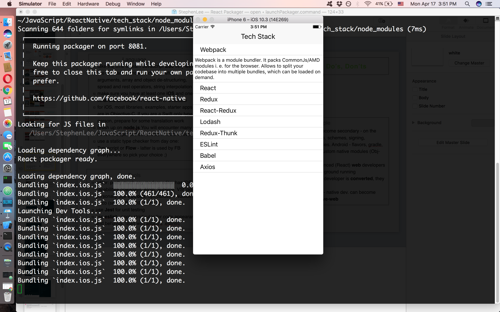
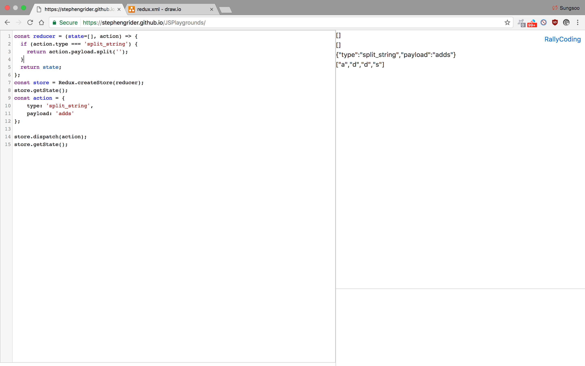

# Welcome to my tech stack Repo!
"Make the most out of every moment."

I built a simple library list application using Redux.
This app will display a list of libraries with details on what they are.

### Setup
```
$ npm install --save redux react-redux # install redux
$ npm install --save-dev eslint-config-rallycoding # make sure to setup [ESlint](ReactNative/tech_stack/.eslintrc) ;)

```

### Tech Stack
React Native with Redux

### Redux
Use [Playground](https://stephengrider.github.io/JSPlaygrounds/)

```js

const reducer = (state=[], action) => {
	if (action.type === 'split_string') {
  	return action.payload.split('');
  } else if (action.type === 'add_character') {
		// this returns new list with elements in state + action.payload
    return [ ...state, action.payload ]; //new ES6 style JS. '...state' means all the elements in state.

  }
  return state;
};
const store = Redux.createStore(reducer);
store.getState();
const action = {
  	type: 'split_string',
  	payload: 'adds'
};

const action2 = {
  type: 'add_character',
  payload: 'a'
};

store.dispatch(action);
store.getState();

store.dispatch(action2);
store.getState();

```



### How Redux works


### How Redux works in React Native


### Lifecycle


### Reducers


### My understanding
1. Start of `provider tag` from `react-redux` library in [app.js](ReactNative/tech_stack/src/app.js) which facilitates the connection between react and redux.
2. Pass instance of redux store  in [app.js](ReactNative/tech_stack/src/app.js).
3. Create two reducers (library and selection) for two different states and combine them together `combineReducers` in [reducers/index.js](ReactNative/tech_stack/src/reducers/index.js) with assigned keys.
4. Each reducer has a state and an action. [reducers/LibraryReducer](ReactNative/tech_stack/src/reducers/libraryReducer.js)
5. Create a action creator [actions/index.js](ReactNative/tech_stack/src/actions/index.js) and it returns action (do sth)
6. `mapStateToProps` function plucks properties out of `state` object and inject them into Components.
